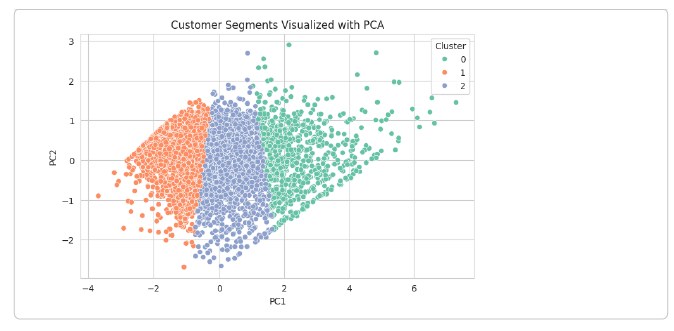
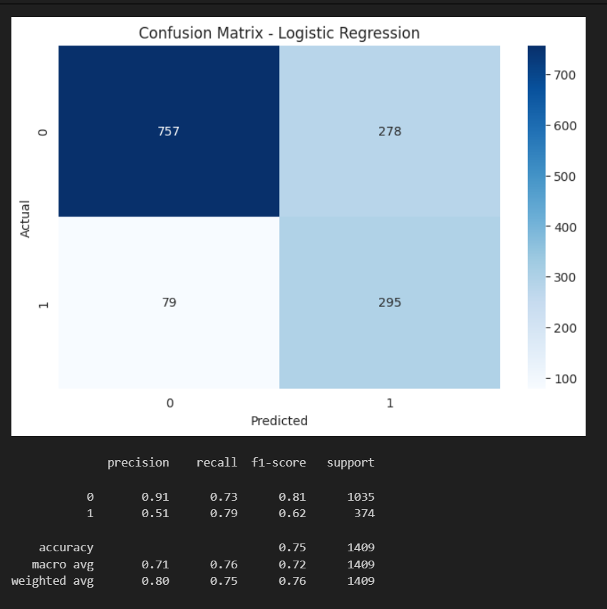
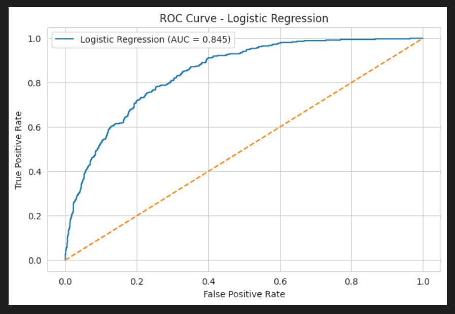

# 📊 Customer Segmentation and Churn Prediction Using Machine Learning


## 📌 Project Overview

This project applies machine learning techniques to analyze customer behavior through two important business tasks:

1. **Customer Segmentation** using an E-commerce dataset  
2. **Customer Churn Prediction** using a Telco dataset

The goal is to better understand customer patterns and support business decision-making through data analysis and predictive modeling.

Customer segmentation helps identify different groups of customers based on purchasing behavior, while churn prediction helps detect customers who are likely to leave a service. Together, these tasks support more effective marketing, retention, and customer relationship strategies.

---

## 🖼 Project Preview

### Customer Segmentation
This output shows how customers were grouped into different clusters based on their purchasing behavior.



### Churn Prediction Confusion Matrix
This result shows how well the churn prediction model classified customers into churn and non-churn categories.



### Model Performance / ROC Curve
This output highlights the predictive performance of the churn prediction model.



---

## 📂 Datasets

### 🛒 E-commerce Dataset
Dataset Source:
https://www.kaggle.com/datasets/carrie1/ecommerce-data

Used for **customer segmentation**.  
It contains transaction-related information such as purchases, quantities, prices, invoice dates, and customer IDs.

### 📡 Telco Customer Churn Dataset
Dataset Source: 
https://www.kaggle.com/datasets/blastchar/telco-customer-churn

Used for **churn prediction**.  
It contains customer demographics, service usage details, billing information, and churn status.

---

## 🧠 Customer Segmentation (E-commerce)

The segmentation workflow included:

- Data cleaning
- Removal of missing customer IDs, duplicates, and cancelled orders
- Exploratory Data Analysis (EDA)
- RFM feature engineering (Recency, Frequency, Monetary)
- Log transformation to reduce skewness
- Feature scaling using `StandardScaler`
- K-Means clustering
- Elbow Method and Silhouette Score for cluster evaluation
- PCA visualization of customer clusters
- Cluster profiling and segment naming

### Final Segments

- ⭐ **High-Value Customers** – frequent buyers with high spending
- 🔹 **Regular Customers** – moderate purchasing behavior
- ⚠️ **Low-Value Customers** – infrequent purchases and low spending

---

## 🤖 Churn Prediction (Telco)

The churn prediction workflow included:

- Data cleaning and preprocessing
- Exploratory analysis of churn distribution
- Encoding and feature preparation
- Train-test split
- Class imbalance handling using **SMOTE**
- Model training using:
  - Logistic Regression
  - Random Forest
  - Gradient Boosting
- Model evaluation using classification metrics

---

## 📈 Model Performance

The churn prediction models were evaluated using the following metrics:

- Accuracy
- Precision
- Recall
- F1 Score
- ROC-AUC
- Confusion Matrix

🏆 **Best Performing Model: Logestic Regression**

---

## 🔑 Key Insights

- Customer segmentation reveals clear differences in purchasing behavior.
- High-value customers contribute significantly to revenue and should be prioritized.
- Churn prediction helps identify customers at risk of leaving.
- Combining segmentation and churn prediction supports data-driven marketing and retention strategies.

---

## 💡 Business Recommendations

- Retain **High-Value Customers** with loyalty programs, exclusive offers, and personalized recommendations.
- Increase engagement of **Regular Customers** through targeted promotions and cross-selling.
- Re-engage **Low-Value Customers** using promotional campaigns and time-limited discounts.
- Use churn prediction outputs to identify at-risk customers early and apply retention strategies such as improved support or special offers.

---

## 🛠 Technologies Used

- Python
- Pandas
- NumPy
- Matplotlib
- Seaborn
- Scikit-learn
- Imbalanced-learn (SMOTE)
- Google Colab / Jupyter Notebook

---

## ▶ How to Run the Project

1. Clone or download the repository.
2. Install the required libraries:

```bash
pip install -r requirements.txt
```

3. Open the notebook file:

```text
notebook/Customer_Segmentation_and_Churn_Prediction_Using_Machine_Learning.ipynb
```

4. Run the notebook in:
- Jupyter Notebook, or
- Google Colab

---

## 📂 Project Structure

```text
customer-segmentation-churn-prediction
├── notebook
│   └── Customer_Segmentation_and_Churn_Prediction_Using_Machine_Learning.ipynb
├── screenshots
│   ├── segmentation.png
│   ├── confusion-matrix.png
│   └── roc-curve.png
├── README.md
└── requirements.txt
```

---

## 👩‍💻 Author

**Hanaa Altaha**